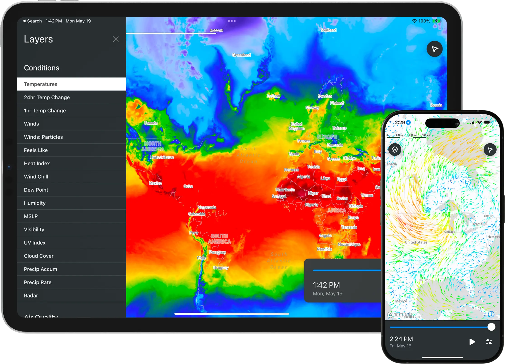

# MapsGL SDK for Apple Platforms



[](https://github.com/vaisala-xweather/mapsgl-apple-sdk/releases)
[](https://github.com/vaisala-xweather/mapsgl-apple-sdk/actions)
[](https://swiftpackageindex.com/vaisala-xweather/mapsgl-apple-sdk)
[](https://cocoapods.org/pods/MapsGL)
[](https://github.com/Carthage/Carthage)

## Overview

MapsGL Apple SDK is a powerful mapping library designed for iOS developers. It enables the integration of MapsGL's rich mapping features into iOS applications, providing a seamless and interactive user experience.

## Features

- Visualizing real-time weather and geospatial data
- High-performance layer rendering with Metal
- Customizable presentation and styling of weather and geospatial information client-side

## Getting Started

We have [in-depth installation and setup guides](http://www.xweather.com/docs/mapsgl-apple-sdk) available for you to get started using the MapsGL SDK for Apple platforms, using Swift Package Manager, Carthage, or direct Xcode integration of MapsGL's xcframeworks.

The following are basic instructions to run the included Demo application, which provides a simple template for integrating MapsGL with your app.

## Running the Demo App

The MapsGL Apple SDK includes a demo application that showcases the capabilities of the SDK. To run the demo application, follow these steps:

### Prerequisites

- Xcode 15 or later
- An Apple Developer account
- An iOS 16+ device (or Xcode's iOS Simulator)
- An Xweather account— We offer a [free developer account](https://www.aerisweather.com/signup/developer/) for you to give our weather API a test drive.
- A Mapbox account

### Steps to Run

1. Log into your Xweather account, and from [your account's Apps page](https://account.aerisweather.com/account/apps), create a new application for the MapsGL Demo app.  Make note of application's *Xweather MapsGL ID* and *Secret*; you'll need them in step 5.

2. The Demo application relies on Mapbox, so you'll need to log into or create a Mapbox account and follow the initial setup portion of [Mapbox Maps SDK for iOS's Installation instructions](https://docs.mapbox.com/ios/maps/guides/install/):
	- Follow the “Configure credentials” instructions to get a *Mapbox public access token* and a *secret access token*.
	- Follow the “Configure your secret token” instructions using your *Mapbox secret access token* in order to be able to download the Mapbox SDK (via Swift Package Manager in the Demo app).
	- Make note of your *Mapbox public access token*; you'll need it in step 5.

3. Clone the repository to your local machine:  
	```
	git clone https://github.com/vaisala-xweather/mapsgl-apple-sdk.git
	```

4. Open `Demo.xcodeproj` in Xcode.

5. Before running the demo, you will need to configure the access keys for MapsGL and Mapbox.
	  - Build the Demo scheme once (Product menu ‣ Build) to auto-create a fresh `AccessKeys.plist` file, then click on `AccessKeys.plist` in the Project Navigator in the left and fill in the `MapboxAccessToken`, `XweatherClientID`, and `XweatherClientSecret` with your keys noted above.

6. Select your target device or simulator at the top of the Xcode window, and press the Build & Run button (▶).

### Exploring the Demo

The demo app demonstrates a variety of raster and encoded MapsGL layers rendered on a Mapbox map.  Layers can be further customized by modifying the demo app's SwiftUI view model in `WeatherLayersModel.swift`, and Mapbox can be customized in `RepresentedMapboxMapView.swift` (which is also point at which MapsGL integrates with Mapbox via MapsGL's `MapboxMapController`).  Experiment, customize, and see how MapsGL can be used in your app.

## Troubleshooting
If you encounter any issues while running the demo application, ensure that:

- Your Xcode and iOS versions meet the prerequisites.
- You have correctly configured the `AccessKeys.plist` with valid API keys.
- There are no build errors related to missing dependencies or configurations.

For further assistance, please refer to the [documentation](http://www.xweather.com/docs/mapsgl-apple-sdk) or contact [support](https://www.xweather.com/support).
